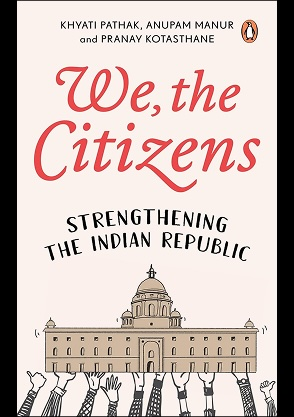
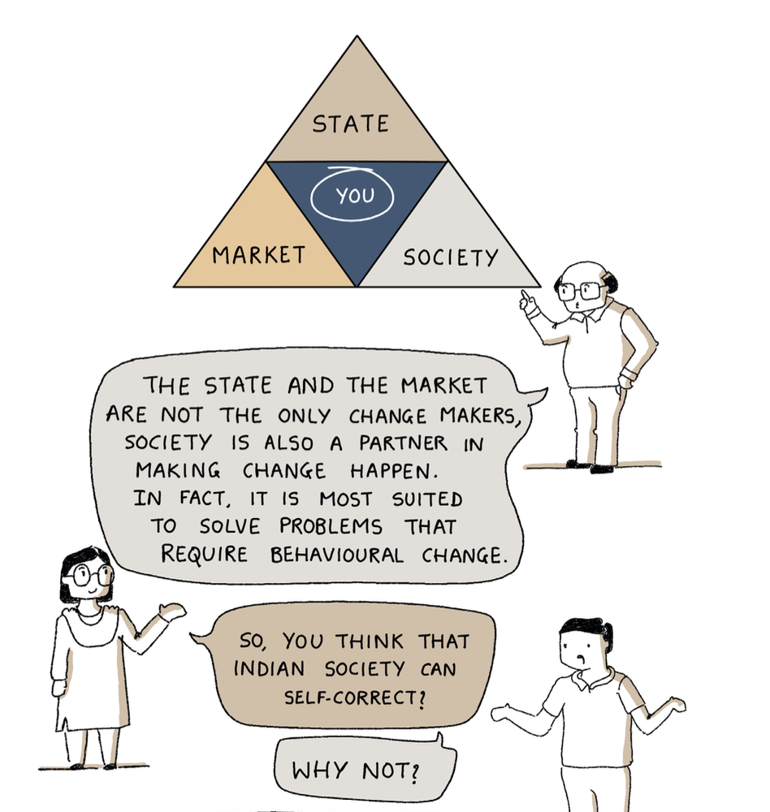

## Published Books

### We, The Citizens: Strengthening the Indian Republic

::: {.book-card}
::: {.grid}
::: {.g-col-3}
{.book-cover}
:::
::: {.g-col-9}
**Co-authored with:** Pranay Kotasthane and Khyati Pathak

*Penguin Random House India, 2024*

What is a republic? How do markets work? What is the role of society in bringing about change? Many of us are unaware of what these entities stand for, how they interact with each other, and how they touch our lives.

*We, The Citizens* decodes public policy in the Indian context in a graphical narrative format relatable to readers of all ages. Whether you want to become an engaged citizen, aspire to be a positive change-maker, or wish to understand our sociopolitical environment, this book is for you.

The idea of India was an audacious dream. The fulfilment of this dream lies upon We, the citizens.

[Buy on Amazon →](https://www.amazon.in/We-Citizens-Strengthening-Indian-Republic/dp/0143463551)
:::
:::
:::

::: {.comic-panels}
**A peek inside — panels from the book:**

::: {layout-ncol=2}

:::
:::
