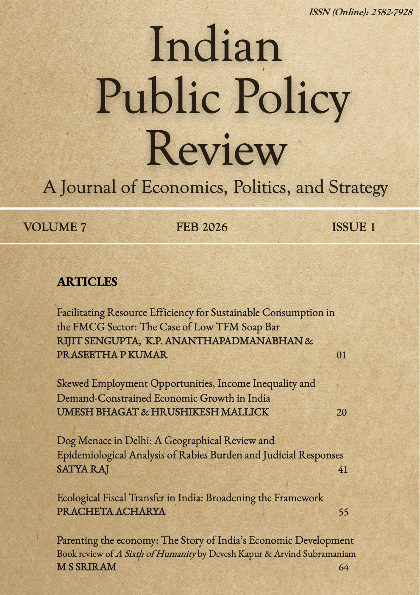

I am the Managing Editor of the **Indian Public Policy Review** — a peer-reviewed, open-access journal dedicated to advancing the understanding of public policy in India.

```{=html}
<div style="display:flex;gap:1rem;flex-wrap:wrap;margin:1.5rem 0;">
  <a href="https://ippr.in" class="btn btn-primary" target="_blank">Visit IPPR →</a>
</div>
```

## Current Issue — Vol. 7 No. 1 (2026)

```{=html}
<div style="text-align:center;margin:2rem 0;">
  <a href="https://ippr.in/index.php/ippr/issue/view/34" target="_blank">
    
  </a>
</div>
```

This edition features five contributions examining diverse policy challenges. It begins with a conceptual piece on regulatory reform in consumer goods, followed by a macroeconomic analysis of employment disparities and their growth implications. The issue then presents a geographical analysis of Delhi's stray dog crisis and associated rabies risks, a commentary proposing the expansion of India's ecological fiscal transfer framework beyond forestry, and concludes with a critical review of recent scholarship on India's post-independence developmental journey.

[Read the full issue →](https://ippr.in/index.php/ippr/issue/view/34){.btn .btn-outline-primary target="_blank"}
